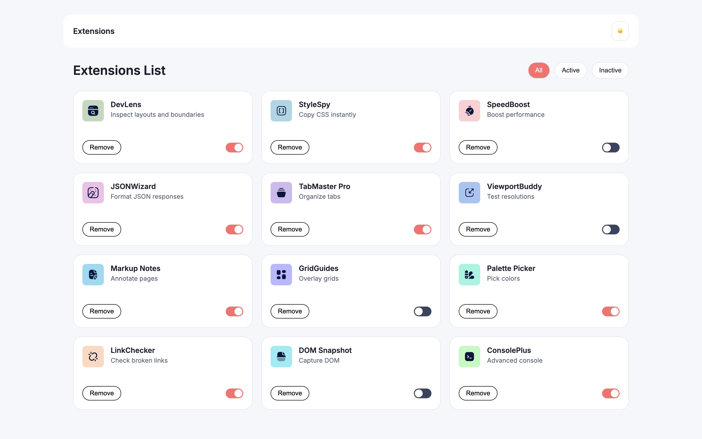
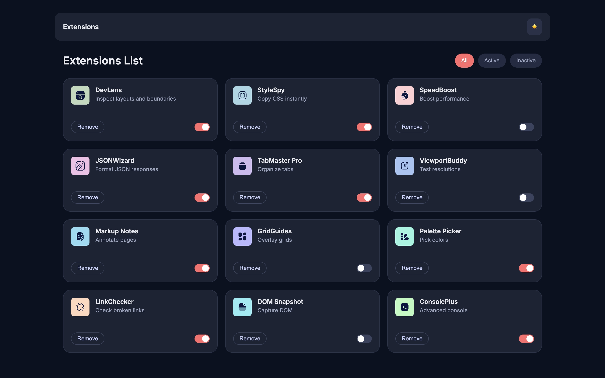
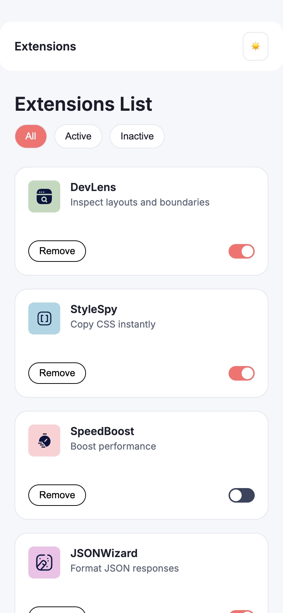
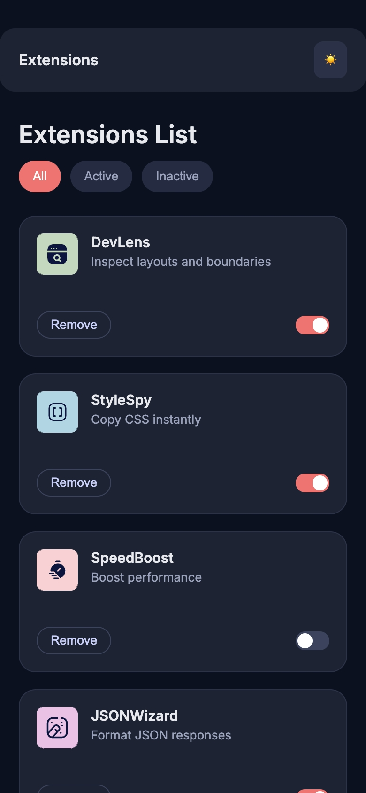

# Browser extension
Project link: 

## Description
Browser extension manager UI

## Features
1. Fully responsive (from 320px to 4K)
2. Filtering — “All”, “Active”, “Inactive” (one click)
3. Status Management — toggle-switch activates/deactivates the extension.
4. Remove — the "Remove" button completely removes the extension from the list.
5. Dark/Light Theme — toggle with saving the selection to `localStorage`.

## Installation and configuration
1. Clone repositories
- `git clone git clone https://github.com/selikon13/Browser-extension-manager-UI.git`
- `cd Browser-extension-manager-UI`
- `code .`
2. Via Live Server (https://github.com/ritwickdey/vscode-live-server-plus-plus )
- Install the Live Server extension for VS Code (or any other code editor)
- Right click on index.html ☞ "Open with Live Server"
- Will automatically open in browser at http://localhost:5000
3. Via Python server
- python3 -m http.server 8000
- pen in your browser: http://localhost:8000

## Screenshots

### Desktop
- **Day background**

- **Night background**

### Mobile
- **Day background**

- **Night background**

## Technologes

- **HTML5** — semantic markup (header, main, section, button, label).
- **CSS3** — Flexbox, Grid Layout, CSS variables (custom properties), media queries, pseudo-classes.
- **JavaScript (ES6+)**:
    - Arrow functions
    - Array methods (forEach, filter, findIndex)
     `dataset` for storing data in markup
    - `classList` for manipulating classes
    - `localStorage` for storing themes
    - Event delegation (on filters, toggle, delete)
    - Dynamic creation of DOM elements (`createElement`, `appendChild`)